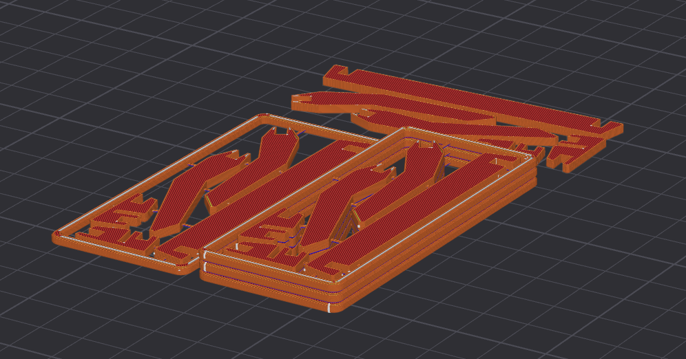

# KURD - 3D Printable Card Stand

A compact, 3D printable card stand designed for DIN A6 sized cards.

## Overview

KURD is a small, practical card stand that can be printed on any standard 3D printer. The design uses a friction-fit assembly system, requiring no glue or additional hardware.

Designed for DIN A6 (105 × 148 mm / 4.1 × 5.8 inches); Larger card sizes may also work depending on the design.

## Files Included

### Individual Parts

- `KURD_front.stl` - Front panel
- `KURD_side_1.stl` - Left side panel
- `KURD_side_2.stl` - Right side panel
- `KURD_leg_left.stl` - Left support leg
- `KURD_leg_right.stl` - Right support leg

### Complete Assembly

- `KURD_framed_complete.stl` - All parts in a single print with support frame

## Printing Options

### Option 1: Individual Parts

Print each part separately using the individual STL files, if you want to, for example:

- do easy multi-color printing
- use different textured build plates
- make replacement parts

### Option 2: Framed Complete Assembly

Print `KURD_framed_complete.stl` for a one-shot print with all parts connected by a temporary frame with small bridge lines.

**Post-processing:** Simply snap or cut the small bridge lines connecting the parts to the frame. These are designed to be easily removed by hand.

## Assembly Instructions

1. If using the framed complete print, remove all parts from the frame by breaking the small bridge lines
2. Clean up any remaining material from the break points if needed
3. Assemble the parts using the friction-fit connections - no glue required
4. Press parts firmly together until they click into place
